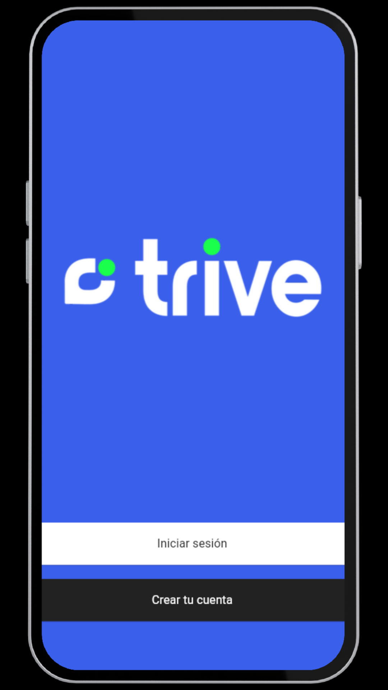
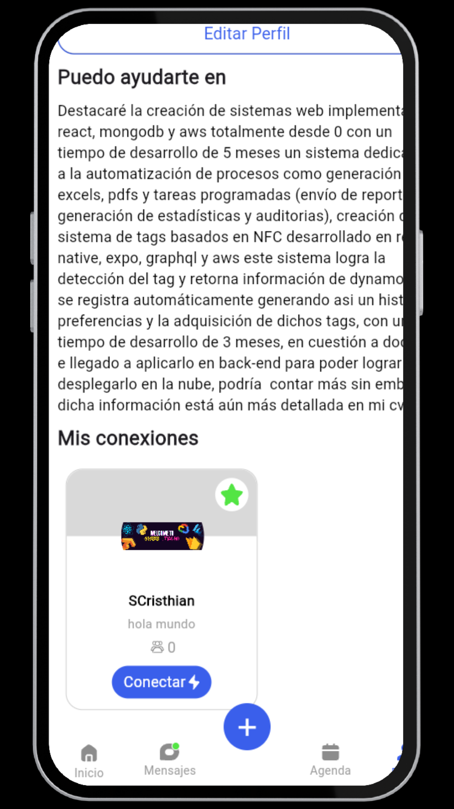
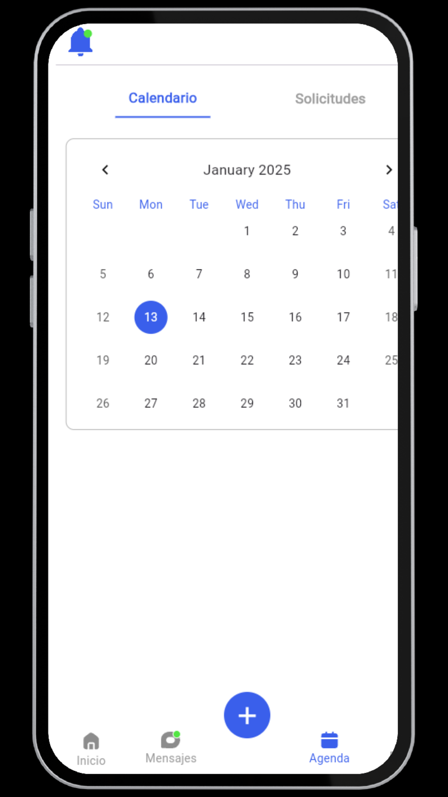
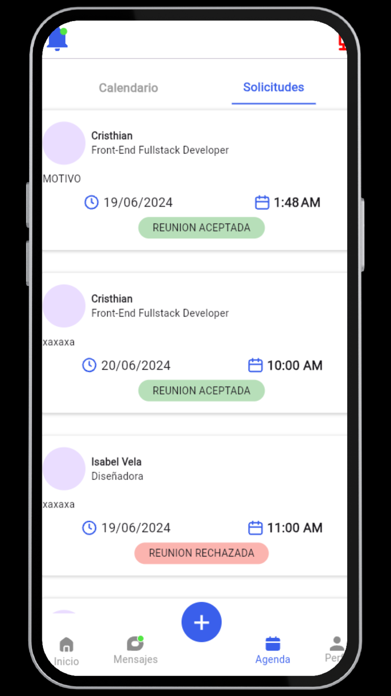
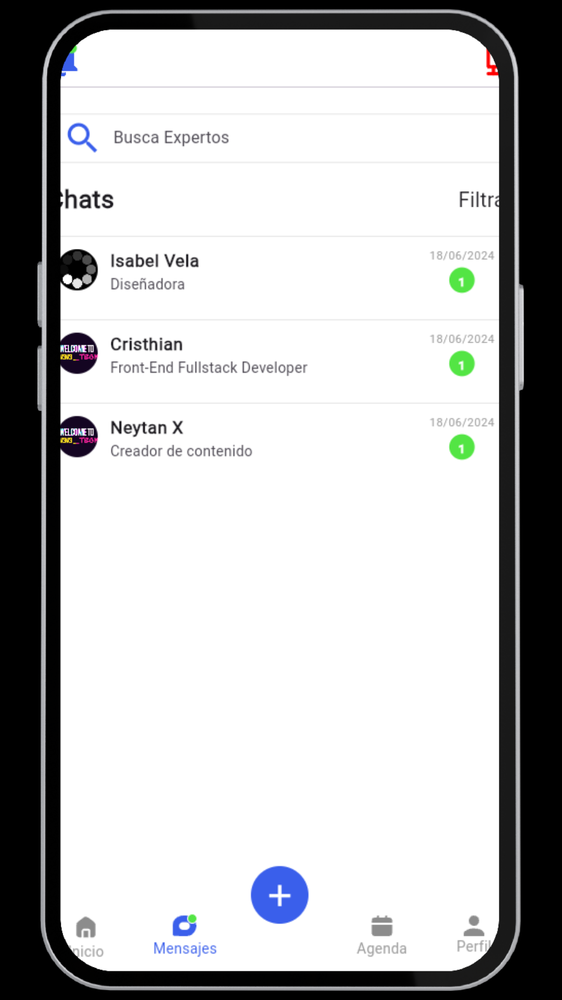
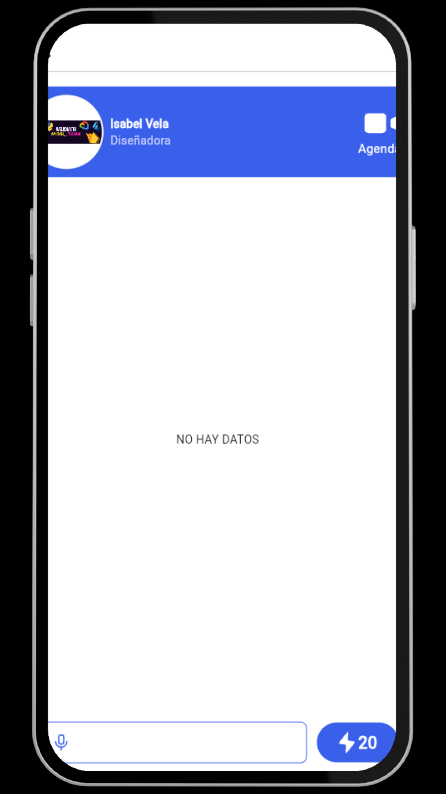
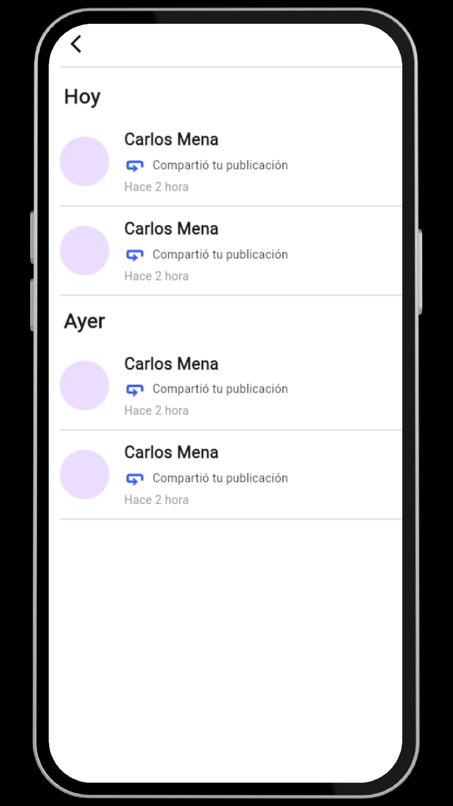
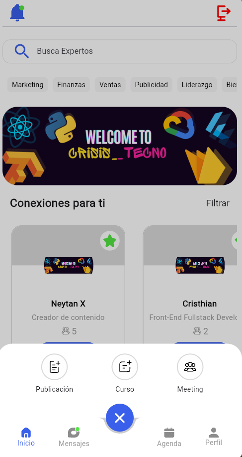
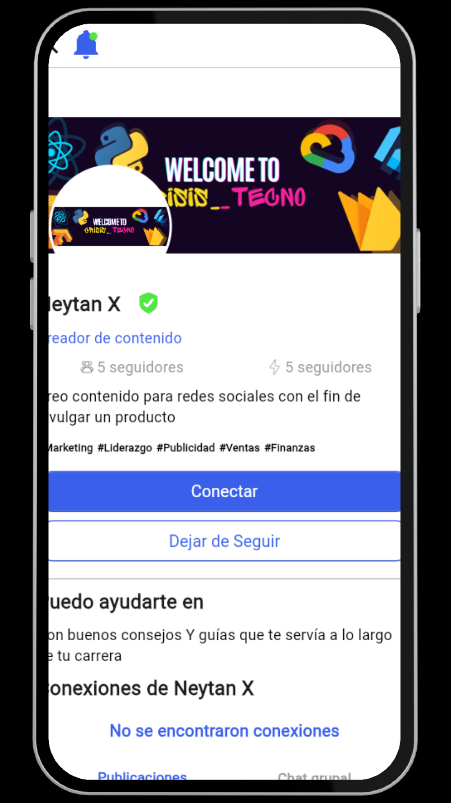

# Trive App 🚀

<p align="center">
  
  
  
</p>
<p align="center">
  
  
  
</p>
<p align="center">
  
  
  
</p>
<p align="center">
  
  
  
</p>
<p align="center">
 
  
  
 
</p>

## ¿Qué es Trive App? 

**Trive App** es una aplicación móvil desarrollada con Flutter, diseñada para poder conectar a expertos en una area con aspirantes a la misma servimos como medio de comunicacion para de esta manera poder dar mas oportunidades a nuevos postulantes a aprender nuevos conceptos apitudes y habilidades que les serviran a lo largo de su camino profesional dentro del area de expertos

## Tecnologías Utilizadas 🛠️

- **Flutter**: Framework de código abierto para la creación de aplicaciones móviles multiplataforma.
- **Dart**: Lenguaje de programación utilizado por Flutter.
- **Firebase**: Plataforma de backend que ofrece servicios como autenticación y base de datos en tiempo real.
    - **Firebase AUTH**
    - **Firebase Storage**
    - **Firebase Notifications**
    - **Firebase Firestore**
- **Provider**: Paquete para la gestión del estado en Flutter.
- **GetX**: Paquete para la gestión del estado en Flutter.
- **Image Picker**: Paquete para el manejo de imagenes dentroFlutter.

## Funcionalidades Clave 🔑

- **Autenticación de Usuarios**: Registro e inicio de sesión utilizando Firebase Authentication.
- **Gestión de [Funcionalidad Principal]**: Permite a los usuarios [descripción de la funcionalidad principal].
- **Notificaciones Push**: Mantiene a los usuarios informados con actualizaciones en tiempo real.
- **Interfaz de Usuario Intuitiva**: Diseño limpio y fácil de usar para una mejor experiencia del usuario.

## Instalación y Configuración 📦

Sigue estos pasos para configurar y ejecutar el proyecto en tu entorno local:

1. **Clona el repositorio**:
   ```bash
   git clone https://github.com/CrisisTecno/trive_app.git
   ```

2. **Navega al directorio del proyecto**:
   ```bash
   cd trive_app
   ```

3. **Instala las dependencias**:
   ```bash
   flutter pub get
   ```

4. **Configura Firebase**:
   - Accede a la [Consola de Firebase](https://console.firebase.google.com/).
   - Crea un nuevo proyecto de Firebase.
   - Configura las aplicaciones para Android e iOS.
   - Descarga los archivos de configuración (`google-services.json` para Android y `GoogleService-Info.plist` para iOS) y colócalos en los directorios correspondientes.

5. **Ejecuta la aplicación**:
   ```bash
   flutter run
   ```

## Estructura del Proyecto 📂

```
trive_app/
├── android/                # Archivos específicos de Android
├── ios/                    # Archivos específicos de iOS
├── lib/                    # Código fuente principal de la aplicación
│   ├── main.dart           # Punto de entrada de la aplicación
│   ├── screens/            # Pantallas de la aplicación
│   ├── widgets/            # Widgets reutilizables
│   └── models/             # Modelos de datos
├── public/assets/                 # Recursos estáticos (imágenes, fuentes, etc.)
├── test/                   # Pruebas unitarias y de integración
├── pubspec.yaml            # Archivo de configuración de Flutter
└── README.md               # Este archivo
```

